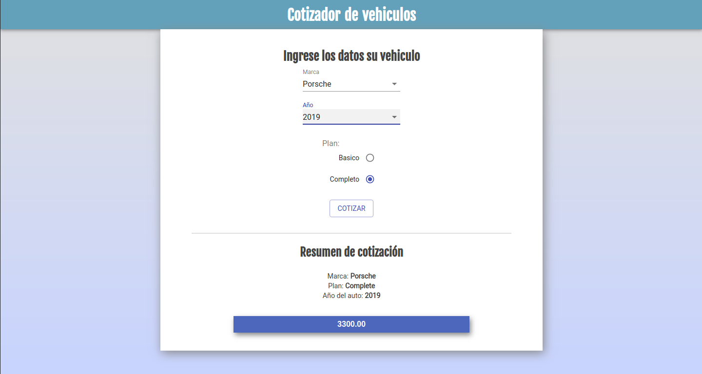

# Cotizador de Vehículos

Aplicación desarrollada en ReactJS que calcula y muestra cotizaciones de seguro para diversas marcas de vehículos.

## Scripts

* `npm install` para instalar las dependencias
* `npm run dev` para entorno de desarrollo
* `npm run build && npm start` para producción

**Nota**: Si no tienes instalado el paquete serve, para correr la aplicación de producción, puedes instalarlo con: `npm install -g serve`

## Licencia

MIT

This project was bootstrapped with [Create React App]
(https://github.com/facebookincubator/create-react-app).
